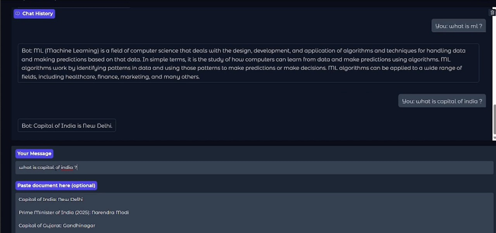

# 🤖 SmartChat: A Hybrid Chatbot with Knowledge Retrieval

📸 **Project Preview**   

---

## 📖 Overview
SmartChat is an AI-powered chatbot that uses TinyLlama (small LLM) and Retrieval-Augmented Generation (RAG) to answer questions with or without context from uploaded documents.

You can ask it anything – and if you give it a business report, summary, or any notes, it will search those and give better, smarter answers!

---

## 🚀 Features
✅ Works like ChatGPT (TinyLlama)  
✅ RAG-based document search for relevant answers  
✅ FAISS + Sentence-Transformers for retrieval  
✅ Beautiful chat UI with Gradio  
✅ Fallback to normal chat if no doc is given  

---

## 🛠 Tech Stack
- **Python**
- **TinyLlama (LLM)** from Hugging Face
- **Sentence-Transformers** (all-MiniLM-L6-v2)
- **FAISS** for vector search
- **Gradio** for web UI
- **PyTorch**

---

## 🔧 Installation & Usage

### 📌 Requirements
- Python 3.8+
- pip
- GPU (optional but faster)
